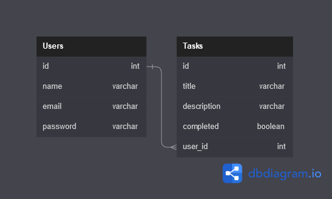

# REST-API with Node JS and Express js

## **Requirements** :mag:
<div>

<div style="display: flex; align-items: center; gap: .5rem">
    
    <h3>
        <a href="https://nodejs.org/en/">NodeJS</a>
    </h3>
</div>

<div style="display: flex; align-items: center; gap: .5rem">
    
    <h3>
        <a href="https://expressjs.com/es/">Express</a>
    </h3>
</div>

<div style="display: flex; align-items: center; gap: .5rem">
    
    <h3>
        <a href="https://dev.mysql.com/doc/">MySQL</a>
    </h3>
</div>

</div>

<br>

## **Steps to setup the project** :rocket:

<br>

### __*Clone the repository*__
```bash
git clone https://github.com/VictorRodas99/rest-api-node.js.git
```

### __*Enter into the main folder*__
```bash
cd rest-api-node.js
```

### __*Install dependencies*__
```bash
npm install
```

### __*Run the server*__
```bash
npm start
```

### __*Run the server (Developer mode)*__
```bash
npm run dev
```

<br>

### __`It will start the server in localhost:8000`__

<br>

## __Documentation and Schemes__

### __*Database representation:*__


To see the entire documentation of the endpoints and schemas: `http://localhost:8000/api/v1/docs`